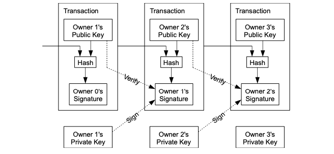

# Blockchain Basics

### Defining Blockchain
* enable peer-2-peer transfer of asset without intermediary (central authority)
* poised to revolutionize:
  - supply chain good transfer
  - digital media transfer
  - remote service delivery
  - decentralized business logic
  - distributed intelligence (education credential)
  - distribute resource (power grid)
  - crowd funding/operation
  - identity management
  - government public records

### Bitcoin
* whitepaper: [Bitcoin: A Peer-to-Peer Electronic Cash System](https://bitcoin.org/bitcoin.pdf)
* establish peer-2-peer trust: validation, verify, confirm (consensus) -> immutable recording on distributed ledger
  - seller: transactions are computationally impractical to reverse
  - buyers: routine "escrow mechanism"
* credit card uses centralized authority: credit card agency, customer bank, credit card bank, exchange, merchant bank
  - disputes are unavoidable, incur mediation costs, which discourages small amount transaction
  - cannot make "non-reversible transaction" for non-reversible service
* rely on cryptographic proof instead of "trust"
* the chain is secure as long as "honest nodes collectively control more CPU power"
* construction of a block transaction:
  - payer input: hash of previous block
  - payer output: payee public key
  - payee input: payer hash (built from payee public key)
  - payee output: sign the block using its private key, hash with next payee's public key

